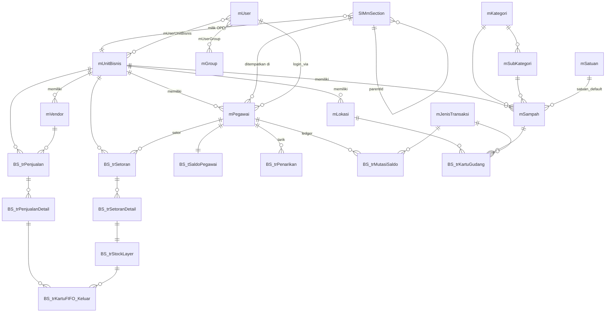

# 02 — Database Schema

> Skema database lengkap. Sumber DDL final untuk migration Supabase.
>
> **Konvensi**: lihat `04-naming-convention.md`. Semua identifier di-quote.

## Overview

Schema dibagi 3 layer:

1. **Master Shared** (reuse Simpus pattern, tanpa `UnitBisnisID`)
2. **Master Per OPD** (`UnitBisnisID NOT NULL`)
3. **Transaksi** (`UnitBisnisID NOT NULL`, `BS_*` prefix)

## ERD Tinggi (Mermaid)



---

## 1. Master Shared

### `mUnitBisnis`

```sql
CREATE TABLE "mUnitBisnis" (
  "UnitBisnisID"      SERIAL PRIMARY KEY,
  "UnitBisnisName"    VARCHAR(150) NOT NULL,
  "Kode_OPD"          VARCHAR(20) UNIQUE NOT NULL,    -- 'BKPSDM','DLH'
  "Tipe_OPD"          VARCHAR(30),                    -- 'DINAS','BADAN','KANTOR','SEKRETARIAT','KECAMATAN'
  "Alamat"            VARCHAR(200),
  "Phone"             VARCHAR(50),
  "Email"             VARCHAR(100),
  "PenanggungJawab"   VARCHAR(100),
  "NomorBukti"        VARCHAR(20) NOT NULL,           -- prefix nomor bukti, e.g. 'BKPSDM'
  "Logo_URL"          TEXT,
  "Warna_Primary"     VARCHAR(7),                     -- '#1E40AF'
  "Config"            JSONB DEFAULT '{}'::jsonb,
  "Status_Aktif"      BOOLEAN NOT NULL DEFAULT TRUE,
  "Tgl_Update"        TIMESTAMPTZ DEFAULT NOW()
);
```

### `SIMmSection` (struktur internal OPD, self-ref)

```sql
CREATE TABLE "SIMmSection" (
  "SectionID"         VARCHAR(10) PRIMARY KEY,
  "SectionName"       VARCHAR(100) NOT NULL,
  "ParentSectionID"   VARCHAR(10) REFERENCES "SIMmSection",
  "Tipe_Section"      VARCHAR(30),                    -- 'SEKRETARIAT','BIDANG','SEKSI','SUBBAG','UPT'
  "Level"             SMALLINT,
  "Path"              TEXT,                           -- '/SEC001/SEC002' untuk query cepat
  "PenanggungJawab"   VARCHAR(100),
  "UnitBisnisID"      INT REFERENCES "mUnitBisnis" NOT NULL,
  "StatusAktif"       BOOLEAN NOT NULL DEFAULT TRUE,
  "NoUrut"            INT DEFAULT 0,
  "Tgl_Update"        TIMESTAMPTZ DEFAULT NOW()
);
CREATE INDEX "idx_SIMmSection_Parent" ON "SIMmSection"("ParentSectionID");
CREATE INDEX "idx_SIMmSection_Unit" ON "SIMmSection"("UnitBisnisID");
CREATE INDEX "idx_SIMmSection_Path" ON "SIMmSection"("Path" text_pattern_ops);
```

### `mUser`, `mGroup`, `mUserGroup`, `mUserUnitBisnis`

```sql
CREATE TABLE "mUser" (
  "User_ID"           SERIAL PRIMARY KEY,
  "Username"          VARCHAR(150) UNIQUE NOT NULL,
  "Nama_Asli"         VARCHAR(200) NOT NULL,
  "Nama_Singkat"      VARCHAR(50),
  "Email"             VARCHAR(150) UNIQUE,
  "Status_Aktif"      BOOLEAN NOT NULL DEFAULT TRUE,
  "Auth_UID"          UUID UNIQUE,                    -- mapping ke auth.users.id (Supabase)
  "Status_Approval"   VARCHAR(20) NOT NULL DEFAULT 'PENDING',
  "Approved_Tgl"      TIMESTAMPTZ,
  "Approved_User_ID"  INT REFERENCES "mUser",
  "Tgl_Daftar"        TIMESTAMPTZ DEFAULT NOW(),
  "Tgl_Update"        TIMESTAMPTZ DEFAULT NOW(),
  CHECK ("Status_Approval" IN ('PENDING','APPROVED','REJECTED'))
);

CREATE TABLE "mGroup" (
  "Group_ID"          SERIAL PRIMARY KEY,
  "Kode_Group"        VARCHAR(30) UNIQUE NOT NULL,    -- MVP: 'ADMIN','NASABAH'
  "Nama_Group"        VARCHAR(100) NOT NULL,
  "Permissions"       JSONB DEFAULT '{}'::jsonb,
  "Status_Aktif"      BOOLEAN DEFAULT TRUE
);

CREATE TABLE "mUserGroup" (
  "UserGroup_ID"      SERIAL PRIMARY KEY,
  "User_ID"           INT REFERENCES "mUser" ON DELETE CASCADE,
  "Group_ID"          INT REFERENCES "mGroup",
  UNIQUE ("User_ID","Group_ID")
);

CREATE TABLE "mUserUnitBisnis" (
  "User_ID"           INT REFERENCES "mUser" ON DELETE CASCADE,
  "UnitBisnisID"      INT REFERENCES "mUnitBisnis",
  PRIMARY KEY ("User_ID","UnitBisnisID")
);
```

> **MVP Auth**: Google login auto-create `mUser` dengan `Status_Approval='PENDING'`,
> role default `NASABAH`, dan mapping awal ke BKPSDM. Admin harus approve user menjadi
> `APPROVED` sebelum user bisa masuk dashboard. Role aktif MVP hanya `ADMIN` dan
> `NASABAH`; role granular lama dapat ditambahkan ulang setelah modul operasional masuk.

### `mKategori`, `mSubKategori`, `mSatuan`, `mJenisTransaksi`

```sql
CREATE TABLE "mKategori" (
  "Kategori_ID"       SERIAL PRIMARY KEY,
  "Kode_Kategori"     VARCHAR(15) UNIQUE NOT NULL,
  "Nama_Kategori"     VARCHAR(50) NOT NULL,           -- 'Anorganik','Organik','B3','Residu'
  "Status_Aktif"      BOOLEAN NOT NULL DEFAULT TRUE
);

CREATE TABLE "mSubKategori" (
  "SubKategori_ID"    SERIAL PRIMARY KEY,
  "Kategori_ID"       INT REFERENCES "mKategori" NOT NULL,
  "Kode_Sub_Kategori" VARCHAR(15) NOT NULL,
  "Nama_Sub_Kategori" VARCHAR(50) NOT NULL,
  "Status_Aktif"      BOOLEAN DEFAULT TRUE
);

CREATE TABLE "mSatuan" (
  "Kode_Satuan"       VARCHAR(10) PRIMARY KEY,
  "Nama_Satuan"       VARCHAR(20) NOT NULL,
  "Satuan_Default"    BOOLEAN DEFAULT FALSE
);

CREATE TABLE "mJenisTransaksi" (
  "JTransaksi_ID"     INT PRIMARY KEY,                -- 700,701,702,...
  "Nama_Transaksi"    VARCHAR(50) NOT NULL
);
```

### `mKategori_Vendor`

```sql
CREATE TABLE "mKategori_Vendor" (
  "Kode_Kategori"     VARCHAR(10) PRIMARY KEY,        -- 'PGPL','PRBR'
  "Kategori_Name"     VARCHAR(100) NOT NULL,
  "Status_Aktif"      BOOLEAN DEFAULT TRUE
);
```

---

## 2. Master Per OPD

### `mPegawai`

```sql
CREATE TABLE "mPegawai" (
  "Pegawai_ID"        SERIAL PRIMARY KEY,
  "User_ID"           INT NOT NULL REFERENCES "mUser" ON DELETE CASCADE,
  "NIP"               VARCHAR(20),
  "Nama_Pegawai"      VARCHAR(200) NOT NULL,
  "No_Telepon"        VARCHAR(20),
  "Email"             VARCHAR(150),
  "Status_Aktif"      BOOLEAN NOT NULL DEFAULT TRUE,
  "UnitBisnisID"      INT NOT NULL REFERENCES "mUnitBisnis",
  "Tgl_Daftar"        TIMESTAMPTZ DEFAULT NOW(),
  "Tgl_Update"        TIMESTAMPTZ DEFAULT NOW(),
  "User_Update"       INT REFERENCES "mUser",
  UNIQUE ("User_ID")
);
CREATE INDEX "idx_mPegawai_Unit" ON "mPegawai"("UnitBisnisID");
CREATE INDEX "idx_mPegawai_User" ON "mPegawai"("User_ID");
CREATE INDEX "idx_mPegawai_NIP" ON "mPegawai"("NIP");
```

Catatan:
- Field lanjutan pegawai (`SectionID`, `Jabatan`, data rekening) ditambahkan pada fase master data pegawai.
- Fase approval user memakai struktur baseline di atas agar onboarding cepat dan konsisten dengan migration aktif.

### `mLokasi`

```sql
CREATE TABLE "mLokasi" (
  "Lokasi_ID"         SERIAL PRIMARY KEY,
  "Kode_Lokasi"       VARCHAR(15) UNIQUE NOT NULL,
  "Nama_Lokasi"       VARCHAR(100) NOT NULL,
  "Tipe_Lokasi"       VARCHAR(30),                    -- 'TPS','GUDANG','KANTOR'
  "Alamat"            TEXT,
  "Latitude"          NUMERIC(10,7),
  "Longitude"         NUMERIC(10,7),
  "UnitBisnisID"      INT REFERENCES "mUnitBisnis" NOT NULL,
  "Gudang_Utama"      BOOLEAN DEFAULT FALSE,
  "Status_Aktif"      BOOLEAN NOT NULL DEFAULT TRUE,
  "Tgl_Update"        TIMESTAMPTZ DEFAULT NOW()
);
CREATE INDEX "idx_mLokasi_Unit" ON "mLokasi"("UnitBisnisID");
```

### RPC Approval User

```sql
approve_user(
  p_user_id int,
  p_role text,
  p_nama_pegawai text,
  p_nip text default null,
  p_no_telepon text default null
) returns jsonb
```

Kontrak response sukses:
`{"ok": true, "user_id": ..., "role": "...", "pegawai_id": ...}`

### `mSampah`

```sql
CREATE TABLE "mSampah" (
  "Sampah_ID"           SERIAL PRIMARY KEY,
  "Kode_Sampah"         VARCHAR(30) UNIQUE NOT NULL,
  "Nama_Sampah"         VARCHAR(200) NOT NULL,
  "Kategori_ID"         INT REFERENCES "mKategori" NOT NULL,
  "SubKategori_ID"      INT REFERENCES "mSubKategori",
  "Kode_Satuan"         VARCHAR(10) REFERENCES "mSatuan" NOT NULL,
  "Harga_Beli"          NUMERIC(14,2) NOT NULL DEFAULT 0,    -- ke pegawai
  "Harga_Jual"          NUMERIC(14,2) NOT NULL DEFAULT 0,    -- ke vendor
  "TglBerlaku_Harga"    TIMESTAMPTZ,
  "HRataRata"           NUMERIC(14,2) DEFAULT 0,             -- WAC
  "Stock_Akhir"         NUMERIC(14,3) DEFAULT 0,
  "Min_Stock"           NUMERIC(14,3) DEFAULT 0,
  "Aktif"               BOOLEAN NOT NULL DEFAULT TRUE,
  "UnitBisnisID"        INT REFERENCES "mUnitBisnis" NOT NULL,
  "Tgl_Update"          TIMESTAMPTZ DEFAULT NOW(),
  "User_Update"         INT REFERENCES "mUser"
);
CREATE INDEX "idx_mSampah_Unit" ON "mSampah"("UnitBisnisID");

CREATE TABLE "mSampah_ChangePrice" (
  "ID"                  SERIAL PRIMARY KEY,
  "Sampah_ID"           INT REFERENCES "mSampah" NOT NULL,
  "Harga_Beli_Lama"     NUMERIC(14,2),
  "Harga_Beli_Baru"     NUMERIC(14,2),
  "Harga_Jual_Lama"     NUMERIC(14,2),
  "Harga_Jual_Baru"     NUMERIC(14,2),
  "Tgl_Update"          TIMESTAMPTZ DEFAULT NOW(),
  "User_ID"             INT REFERENCES "mUser",
  "UnitBisnisID"        INT REFERENCES "mUnitBisnis"
);
```

### `mVendor`

```sql
CREATE TABLE "mVendor" (
  "Vendor_ID"           SERIAL PRIMARY KEY,
  "Kode_Vendor"         VARCHAR(15) UNIQUE NOT NULL,
  "Nama_Vendor"         VARCHAR(150) NOT NULL,
  "Kode_Kategori"       VARCHAR(10) REFERENCES "mKategori_Vendor",
  "Alamat"              TEXT,
  "No_Telepon"          VARCHAR(50),
  "Alamat_Email"        VARCHAR(100),
  "No_NPWP"             VARCHAR(50),
  "Atas_Nama"           VARCHAR(150),
  "Bank"                VARCHAR(100),
  "No_Rek"              VARCHAR(50),
  "Status_Aktif"        BOOLEAN NOT NULL DEFAULT TRUE,
  "UnitBisnisID"        INT REFERENCES "mUnitBisnis" NOT NULL,
  "Tgl_Update"          TIMESTAMPTZ DEFAULT NOW()
);
CREATE INDEX "idx_mVendor_Unit" ON "mVendor"("UnitBisnisID");
```

---

## 3. Transaksi Bank Sampah

### `BS_SequenceCounter` (untuk No Bukti)

```sql
CREATE TABLE "BS_SequenceCounter" (
  "UnitBisnisID"    INT NOT NULL,
  "Kode_Modul"      VARCHAR(5) NOT NULL,
  "Tanggal"         VARCHAR(6) NOT NULL,
  "Counter"         INT NOT NULL DEFAULT 0,
  PRIMARY KEY ("UnitBisnisID","Kode_Modul","Tanggal")
);
```

### `BS_trSetoran` & `BS_trSetoranDetail`

```sql
CREATE TABLE "BS_trSetoran" (
  "No_Bukti"            VARCHAR(50) PRIMARY KEY,
  "Tgl_Setoran"         TIMESTAMPTZ NOT NULL,
  "Pegawai_ID"          INT REFERENCES "mPegawai" NOT NULL,
  "Lokasi_ID"           INT REFERENCES "mLokasi" NOT NULL,
  "Total_Berat"         NUMERIC(14,3) NOT NULL DEFAULT 0,
  "Total_Nilai"         NUMERIC(14,2) NOT NULL DEFAULT 0,
  "Keterangan"          VARCHAR(200),
  "User_ID"             INT REFERENCES "mUser",
  "Tgl_Update"          TIMESTAMPTZ DEFAULT NOW(),
  "Jam_Setor"           TIMESTAMPTZ DEFAULT NOW(),
  "HostName"            VARCHAR(50),
  "Status_Batal"        BOOLEAN NOT NULL DEFAULT FALSE,
  "Posting_KG"          BOOLEAN NOT NULL DEFAULT FALSE,
  "Posting_Saldo"       BOOLEAN NOT NULL DEFAULT FALSE,
  "Posted"              BOOLEAN NOT NULL DEFAULT FALSE,
  "UnitBisnisID"        INT REFERENCES "mUnitBisnis" NOT NULL
);
CREATE INDEX "idx_BS_Setoran_Pegawai_Tgl" ON "BS_trSetoran"("Pegawai_ID","Tgl_Setoran" DESC);
CREATE INDEX "idx_BS_Setoran_Lokasi_Tgl" ON "BS_trSetoran"("Lokasi_ID","Tgl_Setoran" DESC);
CREATE INDEX "idx_BS_Setoran_Unit" ON "BS_trSetoran"("UnitBisnisID","Tgl_Setoran" DESC);

CREATE TABLE "BS_trSetoranDetail" (
  "Detail_ID"           BIGSERIAL PRIMARY KEY,
  "No_Bukti"            VARCHAR(50) NOT NULL REFERENCES "BS_trSetoran" ON DELETE CASCADE,
  "Sampah_ID"           INT REFERENCES "mSampah" NOT NULL,
  "Kode_Satuan"         VARCHAR(10) NOT NULL,
  "Qty"                 NUMERIC(14,3) NOT NULL CHECK ("Qty" > 0),
  "Harga_Beli"          NUMERIC(14,2) NOT NULL,
  "Subtotal"            NUMERIC(14,2) NOT NULL,
  "NoUrut"              SMALLINT NOT NULL
);
CREATE INDEX "idx_BS_SetoranDetail_NoBukti" ON "BS_trSetoranDetail"("No_Bukti");
```

### `BS_trStockLayer`

```sql
CREATE TABLE "BS_trStockLayer" (
  "Layer_ID"            BIGSERIAL PRIMARY KEY,
  "No_Bukti_Setoran"    VARCHAR(50) NOT NULL REFERENCES "BS_trSetoran",
  "Detail_ID_Setoran"   BIGINT REFERENCES "BS_trSetoranDetail",
  "Sampah_ID"           INT REFERENCES "mSampah" NOT NULL,
  "Pegawai_ID"          INT REFERENCES "mPegawai" NOT NULL,
  "Lokasi_ID"           INT REFERENCES "mLokasi" NOT NULL,
  "Qty_Awal"            NUMERIC(14,3) NOT NULL,
  "Qty_Sisa"            NUMERIC(14,3) NOT NULL,
  "Harga_Beli"          NUMERIC(14,2) NOT NULL,
  "Tgl_Masuk"           TIMESTAMPTZ NOT NULL,
  "Status"              VARCHAR(20) NOT NULL DEFAULT 'ACTIVE',
  "UnitBisnisID"        INT REFERENCES "mUnitBisnis" NOT NULL,
  CHECK ("Status" IN ('ACTIVE','EXHAUSTED'))
);
CREATE INDEX "idx_BS_Layer_Active" ON "BS_trStockLayer"("Lokasi_ID","Sampah_ID","Tgl_Masuk")
  WHERE "Status" = 'ACTIVE';
CREATE INDEX "idx_BS_Layer_Pegawai" ON "BS_trStockLayer"("Pegawai_ID","Status");
```

### `BS_trPenjualan` & `BS_trPenjualanDetail` & `BS_trKartuFIFO_Keluar`

```sql
CREATE TABLE "BS_trPenjualan" (
  "No_Bukti"            VARCHAR(50) PRIMARY KEY,
  "Tgl_Penjualan"       TIMESTAMPTZ NOT NULL,
  "Vendor_ID"           INT REFERENCES "mVendor" NOT NULL,
  "Lokasi_ID"           INT REFERENCES "mLokasi" NOT NULL,
  "Total_Berat"         NUMERIC(14,3) NOT NULL DEFAULT 0,
  "Total_Nilai"         NUMERIC(14,2) NOT NULL DEFAULT 0,
  "Total_HPP"           NUMERIC(14,2) NOT NULL DEFAULT 0,
  "Total_Selisih"       NUMERIC(14,2) NOT NULL DEFAULT 0,
  "Type_Pembayaran"     CHAR(1) DEFAULT 'C',           -- C=Cash, T=Transfer
  "Keterangan"          VARCHAR(200),
  "User_ID"             INT REFERENCES "mUser",
  "Tgl_Update"          TIMESTAMPTZ DEFAULT NOW(),
  "Jam_Posting"         TIMESTAMPTZ,
  "HostName"            VARCHAR(50),
  "Status_Batal"        BOOLEAN NOT NULL DEFAULT FALSE,
  "Posting_KG"          BOOLEAN NOT NULL DEFAULT FALSE,
  "Posting_Saldo"       BOOLEAN NOT NULL DEFAULT FALSE,
  "Posted"              BOOLEAN NOT NULL DEFAULT FALSE,
  "Disetujui"           BOOLEAN NOT NULL DEFAULT FALSE,
  "DisetujuiTgl"        TIMESTAMPTZ,
  "DisetujuiUserID"     INT REFERENCES "mUser",
  "UnitBisnisID"        INT REFERENCES "mUnitBisnis" NOT NULL
);
CREATE INDEX "idx_BS_Penjualan_Unit_Tgl" ON "BS_trPenjualan"("UnitBisnisID","Tgl_Penjualan" DESC);
CREATE INDEX "idx_BS_Penjualan_Vendor" ON "BS_trPenjualan"("Vendor_ID");

CREATE TABLE "BS_trPenjualanDetail" (
  "Detail_ID"           BIGSERIAL PRIMARY KEY,
  "No_Bukti"            VARCHAR(50) NOT NULL REFERENCES "BS_trPenjualan" ON DELETE CASCADE,
  "Sampah_ID"           INT REFERENCES "mSampah" NOT NULL,
  "Kode_Satuan"         VARCHAR(10) NOT NULL,
  "Qty"                 NUMERIC(14,3) NOT NULL CHECK ("Qty" > 0),
  "Harga_Jual"          NUMERIC(14,2) NOT NULL,
  "Subtotal"            NUMERIC(14,2) NOT NULL,
  "Total_HPP_Detail"    NUMERIC(14,2) DEFAULT 0,
  "NoUrut"              SMALLINT NOT NULL
);

CREATE TABLE "BS_trKartuFIFO_Keluar" (
  "FIFOKeluar_ID"       BIGSERIAL PRIMARY KEY,
  "Lokasi_ID"           INT NOT NULL,
  "Sampah_ID"           INT NOT NULL,
  "No_Bukti"            VARCHAR(50) NOT NULL,           -- penjualan
  "Detail_ID_Penjualan" BIGINT REFERENCES "BS_trPenjualanDetail",
  "Layer_ID"            BIGINT REFERENCES "BS_trStockLayer" NOT NULL,
  "Pegawai_ID"          INT REFERENCES "mPegawai" NOT NULL,
  "Qty_Keluar"          NUMERIC(14,3) NOT NULL,
  "Harga_Beli"          NUMERIC(14,2) NOT NULL,
  "Harga_Jual"          NUMERIC(14,2) NOT NULL,
  "Selisih_PerKg"       NUMERIC(14,2) NOT NULL,
  "Total_Selisih"       NUMERIC(14,2) NOT NULL,
  "NoBuktiAsal"         VARCHAR(50),                    -- no bukti setoran asal
  "UnitBisnisID"        INT REFERENCES "mUnitBisnis" NOT NULL
);
CREATE INDEX "idx_BS_FIFOKeluar_Pegawai" ON "BS_trKartuFIFO_Keluar"("Pegawai_ID");
CREATE INDEX "idx_BS_FIFOKeluar_Penjualan" ON "BS_trKartuFIFO_Keluar"("No_Bukti");
```

### `BS_trKartuGudang`

```sql
CREATE TABLE "BS_trKartuGudang" (
  "Kartu_ID"            BIGSERIAL PRIMARY KEY,
  "Lokasi_ID"           INT REFERENCES "mLokasi" NOT NULL,
  "Sampah_ID"           INT REFERENCES "mSampah" NOT NULL,
  "No_Bukti"            VARCHAR(50) NOT NULL,
  "JTransaksi_ID"       INT REFERENCES "mJenisTransaksi" NOT NULL,
  "Tgl_Transaksi"       TIMESTAMPTZ NOT NULL,
  "Kode_Satuan"         VARCHAR(10) NOT NULL,
  "Qty_Masuk"           NUMERIC(14,3) NOT NULL DEFAULT 0,
  "Harga_Masuk"         NUMERIC(14,2) NOT NULL DEFAULT 0,
  "Qty_Keluar"          NUMERIC(14,3) NOT NULL DEFAULT 0,
  "Harga_Keluar"        NUMERIC(14,2) NOT NULL DEFAULT 0,
  "Qty_Saldo"           NUMERIC(14,3) NOT NULL DEFAULT 0,
  "Harga_Persediaan"    NUMERIC(14,2) NOT NULL DEFAULT 0,
  "RowTerakhir"         BOOLEAN NOT NULL DEFAULT FALSE,
  "Jam"                 TIMESTAMPTZ DEFAULT NOW(),
  "UnitBisnisID"        INT REFERENCES "mUnitBisnis" NOT NULL
);
CREATE INDEX "idx_BS_KG_Lokasi_Sampah_Tgl" ON "BS_trKartuGudang"("Lokasi_ID","Sampah_ID","Tgl_Transaksi");
CREATE INDEX "idx_BS_KG_RowTerakhir" ON "BS_trKartuGudang"("Lokasi_ID","Sampah_ID")
  WHERE "RowTerakhir" = TRUE;
CREATE INDEX "idx_BS_KG_NoBukti" ON "BS_trKartuGudang"("No_Bukti");
```

### `BS_tSaldoPegawai` & `BS_trMutasiSaldo`

```sql
CREATE TABLE "BS_tSaldoPegawai" (
  "Pegawai_ID"          INT PRIMARY KEY REFERENCES "mPegawai",
  "Saldo_Pending"       NUMERIC(14,2) NOT NULL DEFAULT 0,
  "Saldo_Tersedia"      NUMERIC(14,2) NOT NULL DEFAULT 0,
  "Total_Ditarik"       NUMERIC(14,2) NOT NULL DEFAULT 0,
  "Total_Berat_Setor"   NUMERIC(14,3) NOT NULL DEFAULT 0,
  "Total_Berat_Terjual" NUMERIC(14,3) NOT NULL DEFAULT 0,
  "Tgl_Update"          TIMESTAMPTZ DEFAULT NOW(),
  "UnitBisnisID"        INT REFERENCES "mUnitBisnis" NOT NULL
);

CREATE TABLE "BS_trMutasiSaldo" (
  "Mutasi_ID"               BIGSERIAL PRIMARY KEY,
  "Pegawai_ID"              INT REFERENCES "mPegawai" NOT NULL,
  "JTransaksi_ID"           INT REFERENCES "mJenisTransaksi" NOT NULL,
  "No_Bukti_Ref"            VARCHAR(50),
  "FIFOKeluar_ID_Ref"       BIGINT REFERENCES "BS_trKartuFIFO_Keluar",
  "Pending_Debit"           NUMERIC(14,2) NOT NULL DEFAULT 0,
  "Pending_Kredit"          NUMERIC(14,2) NOT NULL DEFAULT 0,
  "Tersedia_Debit"          NUMERIC(14,2) NOT NULL DEFAULT 0,
  "Tersedia_Kredit"         NUMERIC(14,2) NOT NULL DEFAULT 0,
  "Saldo_Pending_Sesudah"   NUMERIC(14,2),
  "Saldo_Tersedia_Sesudah"  NUMERIC(14,2),
  "Tgl_Mutasi"              TIMESTAMPTZ NOT NULL DEFAULT NOW(),
  "Keterangan"              VARCHAR(300),
  "User_ID"                 INT REFERENCES "mUser",
  "UnitBisnisID"            INT REFERENCES "mUnitBisnis" NOT NULL
);
CREATE INDEX "idx_BS_Mutasi_Pegawai_Tgl" ON "BS_trMutasiSaldo"("Pegawai_ID","Tgl_Mutasi" DESC);
CREATE INDEX "idx_BS_Mutasi_Unit_Tgl" ON "BS_trMutasiSaldo"("UnitBisnisID","Tgl_Mutasi" DESC);
CREATE INDEX "idx_BS_Mutasi_NoBuktiRef" ON "BS_trMutasiSaldo"("No_Bukti_Ref");
```

### `BS_trPenarikan`

```sql
CREATE TABLE "BS_trPenarikan" (
  "No_Bukti"            VARCHAR(50) PRIMARY KEY,
  "Tgl_Penarikan"       TIMESTAMPTZ NOT NULL,
  "Pegawai_ID"          INT REFERENCES "mPegawai" NOT NULL,
  "Jumlah"              NUMERIC(14,2) NOT NULL CHECK ("Jumlah" > 0),
  "Type_Pembayaran"     CHAR(1) NOT NULL,                 -- C=Cash, T=Transfer
  "No_Rek"              VARCHAR(50),
  "Nama_Bank"           VARCHAR(50),
  "Atas_Nama"           VARCHAR(150),
  "Status"              VARCHAR(20) NOT NULL DEFAULT 'PENDING',
  "Disetujui"           BOOLEAN NOT NULL DEFAULT FALSE,
  "DisetujuiTgl"        TIMESTAMPTZ,
  "DisetujuiUserID"     INT REFERENCES "mUser",
  "Tgl_Bayar"           TIMESTAMPTZ,
  "User_Bayar"          INT REFERENCES "mUser",
  "Bukti_Transfer_URL"  TEXT,
  "Keterangan"          VARCHAR(300),
  "User_ID"             INT REFERENCES "mUser",
  "Tgl_Update"          TIMESTAMPTZ DEFAULT NOW(),
  "HostName"            VARCHAR(50),
  "Status_Batal"        BOOLEAN NOT NULL DEFAULT FALSE,
  "Posting_Saldo"       BOOLEAN NOT NULL DEFAULT FALSE,
  "UnitBisnisID"        INT REFERENCES "mUnitBisnis" NOT NULL,
  CHECK ("Status" IN ('PENDING','APPROVED','PAID','REJECTED'))
);
CREATE INDEX "idx_BS_Penarikan_Pegawai" ON "BS_trPenarikan"("Pegawai_ID","Tgl_Penarikan" DESC);
CREATE INDEX "idx_BS_Penarikan_Status" ON "BS_trPenarikan"("Status","UnitBisnisID");
```

---

## 4. Functions & Triggers

> Detail implementasi function `BS_GenerateNoBukti`, `BS_AlokasiPenjualanFifo`, dan trigger `BS_SyncSaldoPegawai`, `BS_PostingKartuGudang` ada di `06-fifo-realisasi-saldo.md`.

## 5. Views (Optional, untuk Reporting)

```sql
-- Stock current per lokasi per sampah
CREATE OR REPLACE VIEW "vBS_StockCurrent" AS
SELECT
  kg."Lokasi_ID", l."Nama_Lokasi",
  kg."Sampah_ID", s."Nama_Sampah",
  kg."Qty_Saldo", kg."Harga_Persediaan",
  kg."UnitBisnisID"
FROM "BS_trKartuGudang" kg
JOIN "mLokasi" l ON l."Lokasi_ID" = kg."Lokasi_ID"
JOIN "mSampah" s ON s."Sampah_ID" = kg."Sampah_ID"
WHERE kg."RowTerakhir" = TRUE;

-- Saldo + ringkasan pegawai
CREATE OR REPLACE VIEW "vBS_RingkasanPegawai" AS
SELECT
  p."Pegawai_ID", p."Nama_Pegawai", p."NIP",
  p."UnitBisnisID", ub."UnitBisnisName",
  COALESCE(s."Saldo_Pending",0)  AS "Saldo_Pending",
  COALESCE(s."Saldo_Tersedia",0) AS "Saldo_Tersedia",
  COALESCE(s."Total_Berat_Setor",0)   AS "Total_Berat_Setor",
  COALESCE(s."Total_Berat_Terjual",0) AS "Total_Berat_Terjual"
FROM "mPegawai" p
JOIN "mUnitBisnis" ub ON ub."UnitBisnisID" = p."UnitBisnisID"
LEFT JOIN "BS_tSaldoPegawai" s ON s."Pegawai_ID" = p."Pegawai_ID";
```
